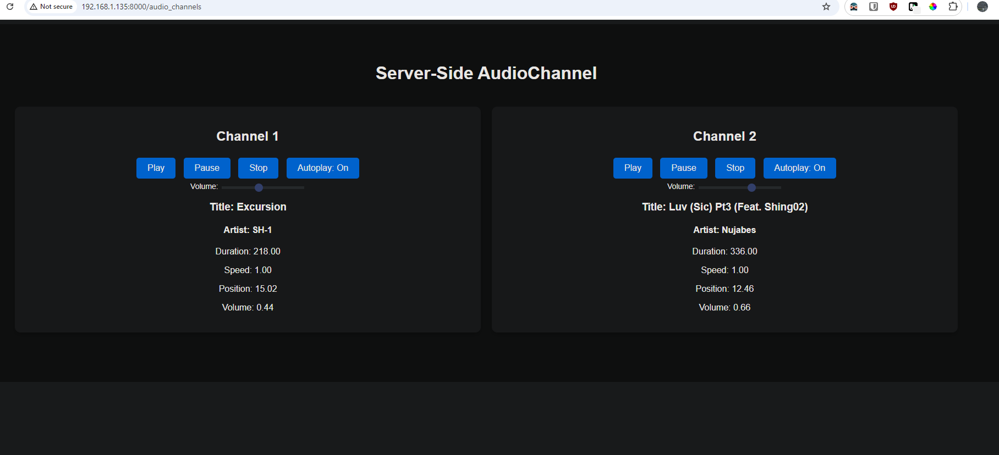

# Example FastAPI App with rpaudio

This is a simple example application that demonstrates how to control audio asynchronously using **FastAPI** and **rpaudio** over WebSockets. The audio is played in the Python process, but it is controlled over the network from a web client. The key feature is that the audio plays where the server is running, not in the browser.



## Installation

To install the required dependencies, run:

```bash
pip install "fastapi[standard] rpaudio"
```

## Running the Application

Open main.py and point the AUDIO_FILE variable to some mp3, wav or flac on your computer.

```py
AUDIO_FILE = r"C:\Users\16145\Desktop\exc.mp3"
```

To start the server, run:

```bash
python main.py
```

## Web Client

The web client communicates with the FastAPI server via WebSockets to control audio playback.

You can then access the application by connecting to your IP on any device that is on the same network as the server!
e.g.

```
192.168.1.126:8000/audio_channels
```

In your browser on your phone, tablet or pc.
